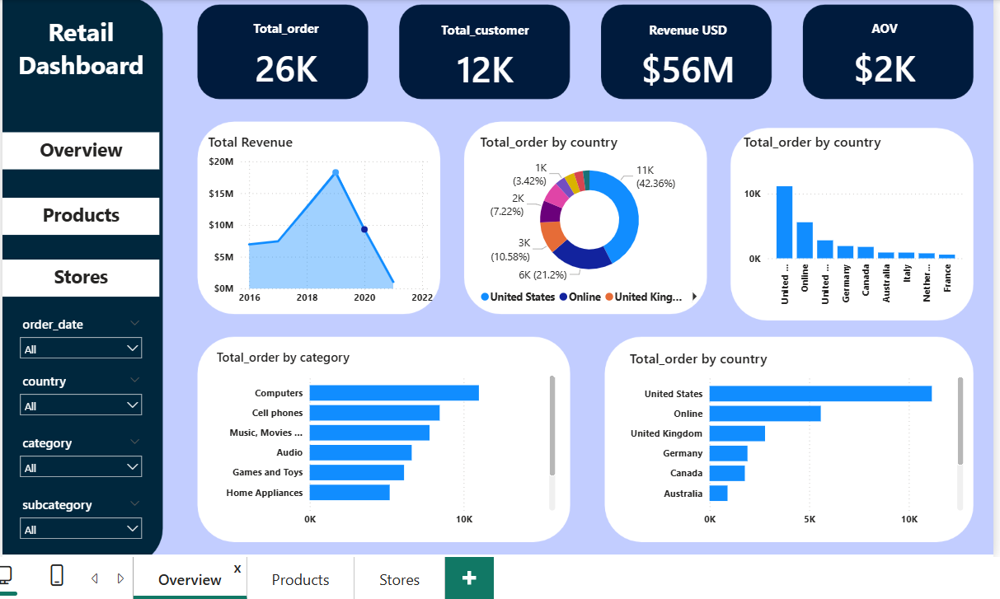
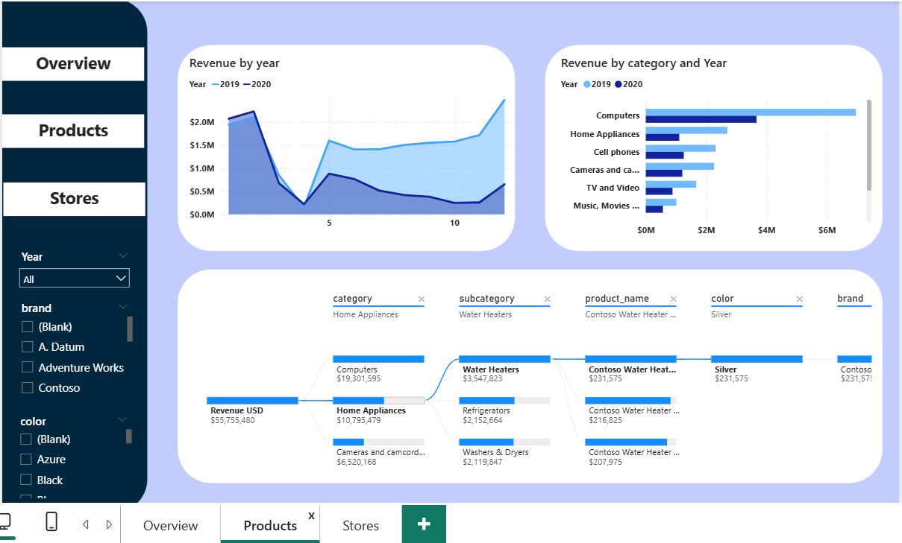
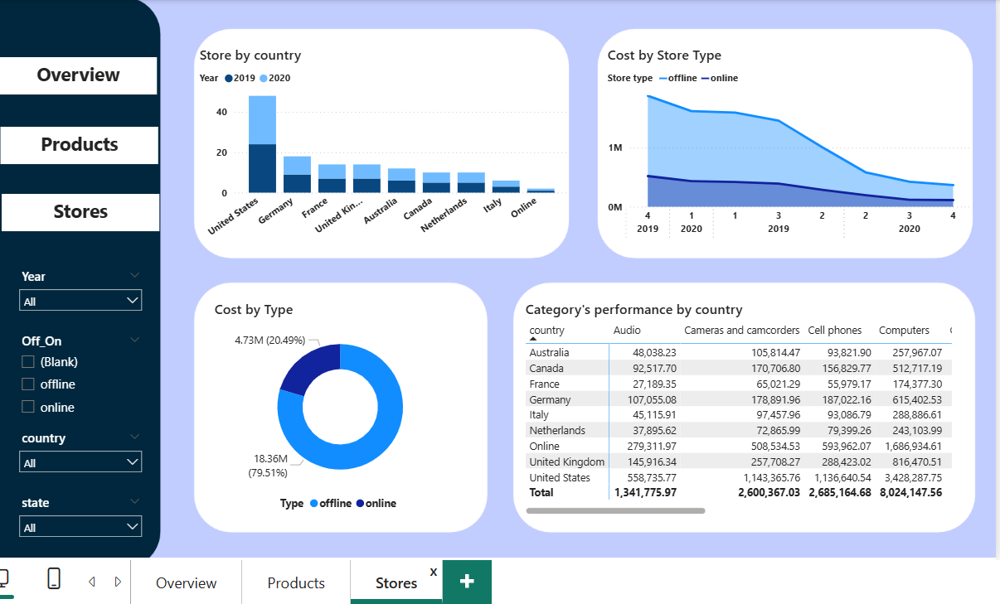

# 📊 Retail Dashboard

A Power BI dashboard designed to visualize sales performance metrics for a global retail company. The report helps stakeholders has strategic decision-making in retail operations.

## 📈 Key Features

- Total revenue and units sold over time
- Best-selling products and sales by category
- Store performance by region
- Visual storytelling with retail KPIs

## 🧹 Data Processing

The report was built upon four relational datasets:

- **Transactions**: Sales transaction logs including quantity, date, and customer/product IDs
- **Products**: Product catalog with name, category, and pricing
- **Customers**: Customer demographics (age, gender, location)
- **Stores**: Store details by region and address

## 📁 Tools & Technologies

- **SQL Server**: Data source
- **Power Query**: ETL workflows and data shaping
- **Power BI**: Data modeling, DAX, dashboard design
- Relationship diagram optimization
- Business-centric report layout and navigation

## 📂 Files Included

- `retail.pbix` – Power BI project file
- `overview.png`, `product.png`, `store.png`  – Dashboard preview image
