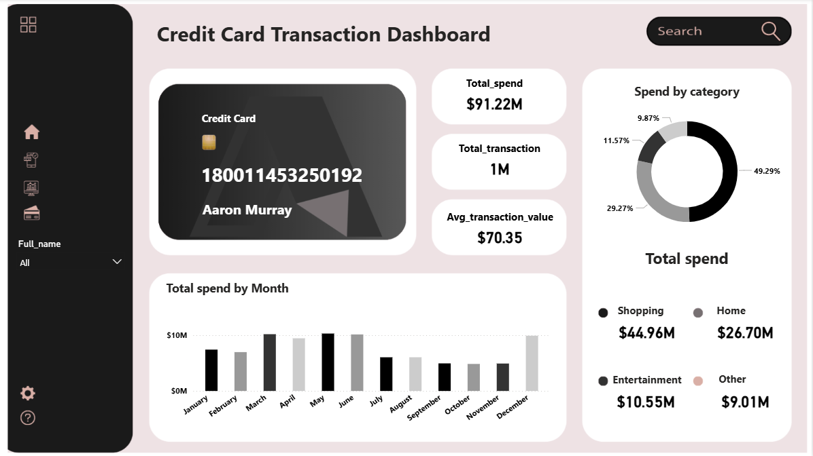

# 📊 Preview dashboard

---

## 📁 Cấu trúc file

```              
├── Personal Credit Card
│   ├── README.md               
│   └── image.png                    

```

---

## 🗂️ Mô tả Dataset

**File:** `credit_card_transactions.csv`  
**Số dòng:** More than 1.000.000 rows 

| Cột | Kiểu dữ liệu | 
|-----|-------------|
| `trans_date_trans_time` | Datetime  
| `cc_num,merchant` | Integer  
| `Category` | String 
| `amt` | Float    
| `first` | String 
| `last` |  String  
| `gender` | String 
| `stress` |  String  
| `city` | String 
| `state` |  String  
| `zip` | Integer 
| `lat` | String 
| `long` |  String  
| `city_pop` | String 
| `job` |  String  
| `dob` | String 
| `trans_num` |  Float  
| `unix_time` |  String  
| `merch_lat` | String 
| `merch_long` |  String  
| `is_fraud` | String 
| `merch_zipcode` |  String 

## 📝 Ghi chú

- Tools: **Power BI Desktop**
